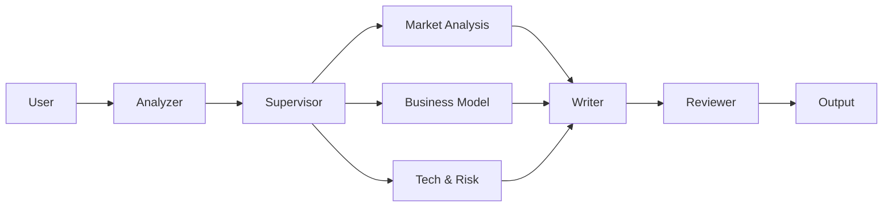

# PlanCraft Agent

> **AI 기반 웹/앱 서비스 기획서 자동 생성 Multi-Agent 시스템**

[](https://langchain-ai.github.io/langgraph/)
[](https://www.python.org/)
[](https://streamlit.io/)
[](./LICENSE)

---

## 서비스 핵심 흐름

> **과제 평가용 문서**: 시스템 설계 및 상세 리포트는 [**PROJECT_REPORT.md**](docs/PROJECT_REPORT.md)를 참조해주세요.

사용자의 아이디어가 **전문 에이전트 팀**과 **Supervisor**의 협업을 통해 완벽한 기획서로 탄생합니다.



---

## 핵심 기능

### 1. Plan-and-Execute 아키텍처
단순 순차 실행이 아닌, **Supervisor**가 계획을 수립하고 **Specialist Agent**들이 병렬로 작업을 수행합니다.

| Agent | 역할 |
|-------|------|
| **Market Agent** | 시장 규모(TAM/SAM/SOM) 및 경쟁사 심층 분석 |
| **BM Agent** | 수익 모델, 가격 정책, BEP 분석 |
| **Risk Agent** | 법적/기술적 리스크 및 SWOT 분석 |
| **Tech Agent** | 기술 스택 및 아키텍처 설계 |
| **Content Agent** | 브랜딩 및 마케팅 전략 |

### 2. 스마트 입력 & HITL (Human-in-the-Loop)
- **간단한 질문**: AI가 챗봇처럼 즉시 답변
- **모호한 요청**: "사용자에게 되물어보기(Interrupt)" 기능을 통해 의도를 명확히 파악
- **제약조건 준수**: "광고 수익만 원함" 같은 사용자의 제약조건을 모든 에이전트가 준수
- **프롬프트 증폭**: 짧은 입력도 AI가 구체적인 컨셉으로 확장 제안

### 3. 브레인스토밍 (Idea Generator)
아이디어가 없을 때 **8개 카테고리**에서 트렌디한 서비스 아이디어를 제안받을 수 있습니다:

| 카테고리 | 예시 |
|----------|------|
| IT/Tech | AI 코딩 어시스턴트, SaaS 플랫폼 |
| 금융/핀테크 | 자산관리 앱, P2P 대출 |
| F&B | 맞춤형 식단 배달, 스마트 주방 |
| 헬스케어 | 원격 진료, 피트니스 앱 |
| 교육 | AI 튜터, 어학 학습 플랫폼 |
| 라이프스타일 | 반려동물 케어, 취미 매칭 |
| 커머스 | D2C 브랜드, 구독 서비스 |
| 엔터테인먼트 | 숏폼 콘텐츠, 게이미피케이션 |

### 4. 품질 프리셋 (Quality Presets)

| 모드 | 속도 | 특징 | 추천 상황 |
|------|------|------|----------|
| **Fast** | <1분 | 핵심 위주, 시각자료 제외 | 아이디어 스케치 |
| **Balanced** | 2~3분 | 균형잡힌 분석, Mermaid 다이어그램 포함 | 일반 기획서 (기본값) |
| **Quality** | 3~5분 | 심층 분석, 복합 시각화, 3회 검증 | 투자 제안서 |

### 5. Advanced RAG + Web Search
- **RAG (내부 지식)**: Multi-Query + Query Expansion + Context Reorder
- **Web Search (외부 지식)**: Tavily 기반 실시간 시장 데이터 수집

### 6. 시각적 요소 자동 생성
- **Mermaid 다이어그램**: 시스템 아키텍처, 사용자 플로우
- **ASCII 차트**: 성장 지표, 수익 예측

---

## 빠른 시작

### 1. 환경 설정

```bash
# 저장소 클론
git clone https://github.com/skyasu2/skax.git
cd skax

# 가상환경 생성 및 의존성 설치
python -m venv .venv
source .venv/bin/activate  # Windows: .venv\Scripts\activate
pip install -r requirements.txt
```

### 2. 실행

```bash
# 환경변수 설정 (.env)
cp .env.example .env

# 앱 실행
streamlit run app.py
```

브라우저에서 `http://localhost:8501` 접속

---

## 문서 (Documentation)

| 문서 | 설명 |
|------|------|
| [**SYSTEM_DESIGN.md**](docs/SYSTEM_DESIGN.md) | 시스템 아키텍처 상세 설계서 **(과제 제출용)** |
| [**PROJECT_REPORT.md**](docs/PROJECT_REPORT.md) | 프로젝트 리포트 **(과제 제출용)** |
| [USER_MANUAL.md](docs/USER_MANUAL.md) | 사용자 가이드 |
| [DEVELOPER_GUIDE.md](docs/DEVELOPER_GUIDE.md) | 개발자 가이드 |
| [WORKFLOW_GUIDE.md](docs/WORKFLOW_GUIDE.md) | 워크플로우 상세 |
| [HITL_GUIDE.md](docs/HITL_GUIDE.md) | Human-in-the-Loop 가이드 |

---

## 시스템 구조

```
plancraft-agent/
├── app.py                  # Streamlit UI
├── agents/                 # AI Agents (Analyzer, Writer, etc.)
│   ├── specialists/        # Specialist Squad (Market, BM, Risk, Tech, Content)
│   └── supervisor.py       # Orchestrator
├── graph/                  # LangGraph Workflow & HITL Logic
├── rag/                    # RAG Engine (FAISS + Advanced RAG)
├── tools/                  # Web Search Tools (Tavily)
├── ui/                     # UI Components & Styles
├── utils/                  # Settings, LLM, Retry, Time Context
└── docs/                   # Documentation
```

---

## 기술 스택

- **LLM Orchestration**: LangGraph, LangChain
- **LLM**: Azure OpenAI (GPT-4o, GPT-4o-mini)
- **Vector DB**: FAISS
- **UI**: Streamlit
- **Backend**: FastAPI (선택적)
- **Checkpointer**: Memory / PostgreSQL / Redis

---

**Made with LangGraph + Streamlit**
