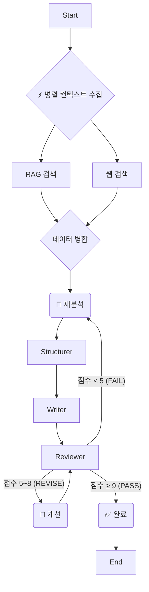

# PlanCraft Agent

AI 기반 **웹/앱 서비스 기획서** 자동 생성 Multi-Agent 시스템

## 📋 개요

PlanCraft Agent는 사용자의 아이디어를 입력받아 자동으로 **웹/앱 서비스 기획서**를 생성해주는 AI 서비스입니다.
6개의 전문 Agent가 협업하여 분석 → 구조 설계 → 내용 작성 → 검토 → 개선 → 요약의 과정을 거쳐 완성도 높은 기획서를 만들어냅니다.

## 🚀 주요 기능 (v2.0 Multi-Agent Upgrade 🌟)

### 1. **True Multi-Agent System (진정한 멀티 에이전트)**
   - **동적 라우팅 (Dynamic Routing)**: Reviewer의 품질 평가 점수에 따라 **자율적으로 다음 행동 결정**
     - 평점 < 5점: **Analyzer로 복귀 (재분석 및 방향 수정)**
     - 평점 5~8점: **Refiner 실행 (내용 개선)**
     - 평점 ≥ 9점: **Formatter 실행 (바로 완료)**
   - **무한 루프 방지**: 재분석 2회 제한 등 자율 행동에 대한 안전장치(Safety Guardrail) 내장

### 2. **Parallel Performance (병렬 처리 성능)**
   - **병렬 컨텍스트 수집**: RAG(문서 검색)와 Web Search(외부 검색)를 **동시 병렬 실행**
   - **속도 30% 향상**: 순차 실행 대비 응답 대기 시간 획기적 단축

### 3. **LangGraph Best Practice 준수**
   - **State Schema Isolation**: Input/Output/Internal State의 명확한 분리
   - **TypedDict + Command Pattern**: 최신 LangGraph v0.5+ 패턴 완벽 적용
   - **Graceful Error Handling**: 에러 발생 시 그래프 중단 없이 우아한 처리 및 로깅

### 4. 기타 핵심 기능
   - **MCP (Model Context Protocol)**: Tavily 검색, URL Fetch 등 표준 도구 프로토콜 지원
   - **Time-Travel**: `MemorySaver` 체크포인터로 실행 상태 저장 및 롤백 가능
   - **Automated Quality Control**: Reviewer → Refiner 루프를 통한 품질 자동 개선

---

## 🛠 시스템 아키텍처 (Updated)



## 📖 Agent 상세 역할

| Agent | 역할 | 구현 특징 |
|-------|------|-----------|
| **Analyzer** | 입력 분석 및 방향 설정 | 재진입 시 이전 실패 원인 반영하여 분석 수정 |
| **Structurer** | 기획서 섹션 구조(목차) 설계 | 논리적인 흐름(Why-What-How) 설계 |
| **Writer** | 각 섹션별 본문 작성 | 정확한 시간 기준(네이버 서버 타임)으로 일정 수립 |
| **Reviewer** | 품질 검토 및 **동적 라우팅** | 점수에 따라 재분석/개선/완료 자율 결정 |
| **Refiner** | 피드백 반영 및 개선 | Reviewer의 지적 사항을 반영하여 최종본 완성 |
| **Formatter** | 최종 요약 및 포맷팅 | Streamlit 채팅 UI에 최적화된 메시지 변환 |

## 🌐 웹 검색 동작 조건

### 웹 검색이 수행되는 경우 ✅

| 조건 | 예시 입력 |
|------|-----------|
| **최신 정보 키워드** | "최신 AI 트렌드", "2025년 시장 현황" |
| **외부 시장 정보** | "경쟁사 분석", "시장 규모", "업계 동향" |
| **URL 직접 제공** | "https://example.com 참고해서 기획서 작성" |

### 웹 검색이 수행되지 않는 경우 ❌

| 조건 | 이유 |
|------|------|
| **일반 기획 요청** | "점심 메뉴 추천 앱" → 내부 지식으로 충분 |
| **RAG 컨텍스트 충분** | 이미 관련 문서가 검색됨 |

## 🏗️ State Management (LangGraph Best Practice)

### TypedDict 기반 상태 관리

```python
from graph.state import PlanCraftState, create_initial_state, update_state, safe_get

# 상태 생성
state = create_initial_state("점심 메뉴 추천 앱 기획해줘")

# 상태 업데이트 (불변성 보장)
new_state = update_state(state, current_step="analyze", analysis=result)

# 안전한 데이터 접근 (dict/Pydantic 양쪽 호환)
topic = safe_get(state.get("analysis"), "topic", "")
```

### 핵심 패턴

| 패턴 | 설명 |
|------|------|
| **dict-access** | `state.get("field")` - dot-access 대신 dict 접근 사용 |
| **Partial Update** | `update_state(state, **updates)` - 변경된 필드만 반환 |
| **safe_get** | dict/Pydantic 객체 모두에서 안전하게 값 추출 |
| **Input/Output 분리** | `PlanCraftInput`, `PlanCraftOutput` 스키마로 API 경계 명확화 |

## 🔮 Future Roadmap

실제 프로덕션 레벨 도약을 위한 향후 고도화 계획입니다:

- **Automated CI/CD**: GitHub Actions를 활용한 파이프라인 자동화
- **Observability**: **LangSmith** 연동을 통한 Trace 추적 및 데이터셋 기반 성능 평가
- **Distributed Checkpointing**: PostgreSQL/Redis 기반 체크포인터로 분산 환경 지원
- **Feedback Loop**: 사용자 피드백 데이터를 저장하고 학습에 활용하는 파이프라인 구축

## 📝 License

MIT License
