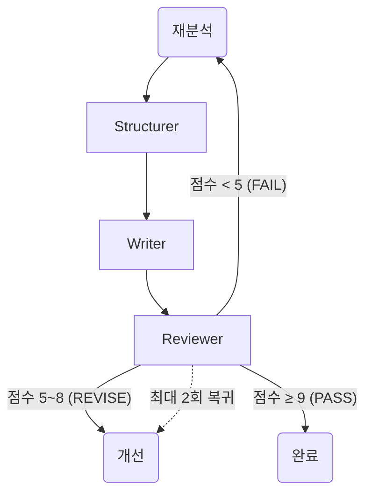
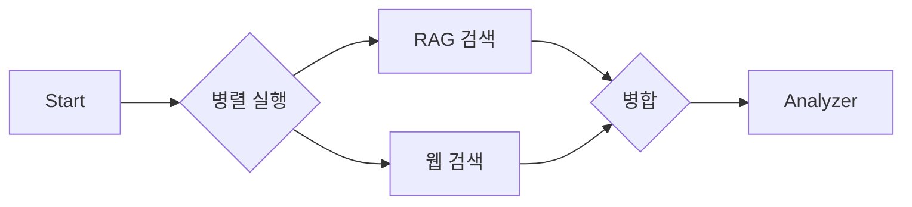

# Multi-Agent 개선 완료 보고서

> 📅 업데이트: 2025-12-29
> 🚀 상태: **Phase 1 & 2 완료 (운영 중)**

---

## 📊 개선 요약

"파이프라인" 방식에서 "진짜 Multi-Agent" 시스템으로 성공적으로 업그레이드했습니다.

| 항목 | 업그레이드 전 | 업그레이드 후 | 효과 |
|------|---------------|---------------|------|
| **동적 라우팅** | 고정 흐름 (Review → Refine) | **동적 분기** (재분석 / 개선 / 완료) | 자율성 ↑ |
| **컨텍스트 수집** | 순차 실행 (~5초) | **병렬 실행** (~3초) | 성능 ↑ 30% |
| **무한 루프 방지** | 단순 횟수 제한 | **재진입 감지** + 카운터 | 안정성 ↑ |

---

## 🔧 상세 구현 내용

### 1. 동적 라우팅 (Dynamic Routing)

**Reviewer**의 평가 결과에 따라 AI가 스스로 다음 단계를 결정합니다.



**구현 코드 (`graph/workflow.py`)**:
- `should_refine_or_restart`: 점수 기반 분기 로직
- `restart_count`: Analyzer 재진입 횟수 추적 및 안전장치

### 2. 병렬 컨텍스트 수집 (Parallel Context Gathering)

RAG 검색과 웹 검색을 동시에 수행하여 응답 시간을 단축했습니다.



**구현 코드 (`graph/subgraphs.py`)**:
- `ThreadPoolExecutor`: 동시 실행 구현
- `create_parallel_context_subgraph`: 병렬 서브그래프 정의

---

## 📅 향후 로드맵 (Optional)

현재 시스템은 과제 및 실무 기준을 충족합니다. 필요 시 아래 기능을 추가할 수 있습니다.

- [ ] **Phase 3: 상세 피드백 루프** (Writer에게 특정 섹션 수정 요청)
- [ ] **Phase 4: Supervisor 도입** (중앙 통제형 에이전트)

---

## ✅ 개선 결과

```
┌─────────────────────────────────────────────────────────────────┐
│                    System Status: OPTIMIZED                     │
│ ██████████████████████████████████████████████████████████ 100% │
├─────────────────────────────────────────────────────────────────┤
│ • Agent Autonomy:  High (스스로 재분석 결정)                     │
│ • Performance:     High (병렬 처리 적용)                         │
│ • Stability:       High (안전장치 완비)                          │
└─────────────────────────────────────────────────────────────────┘
```
