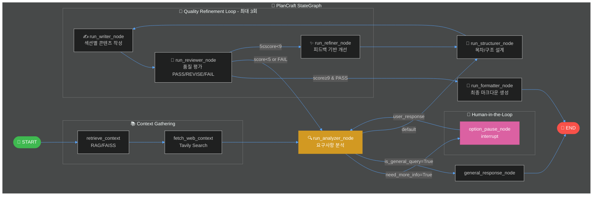
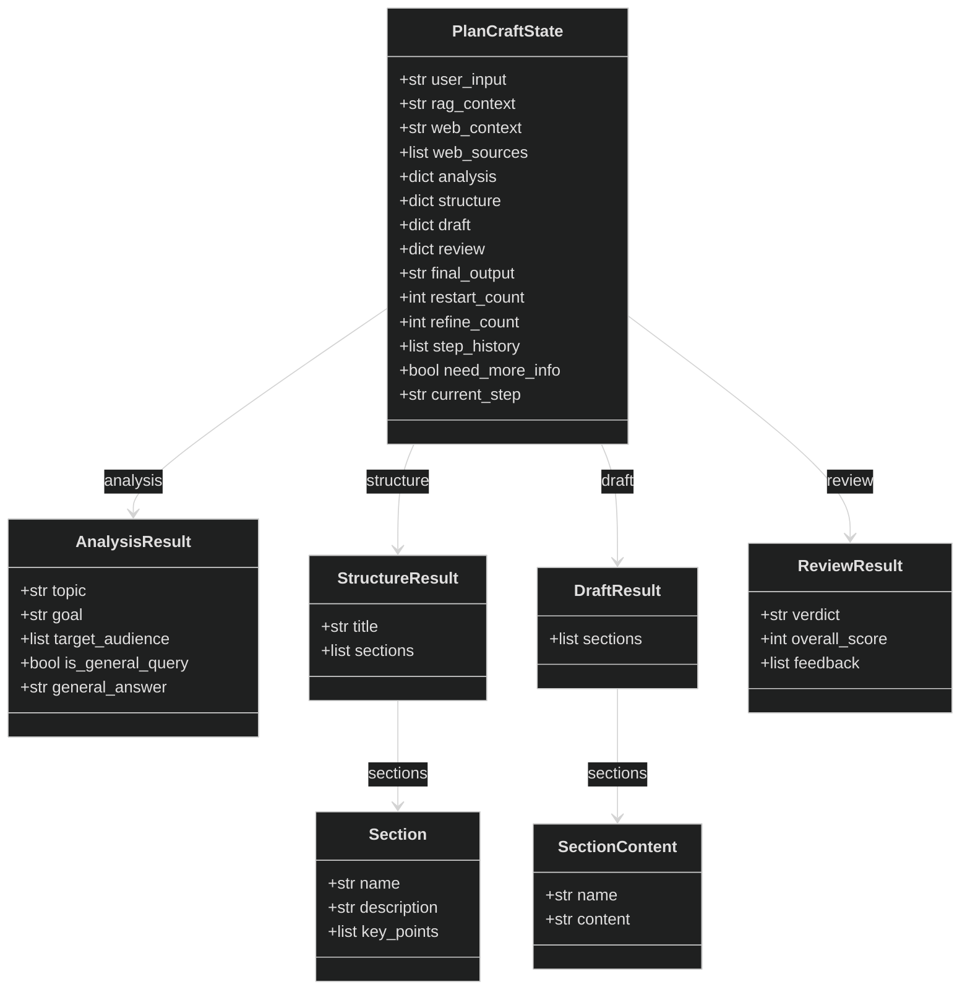
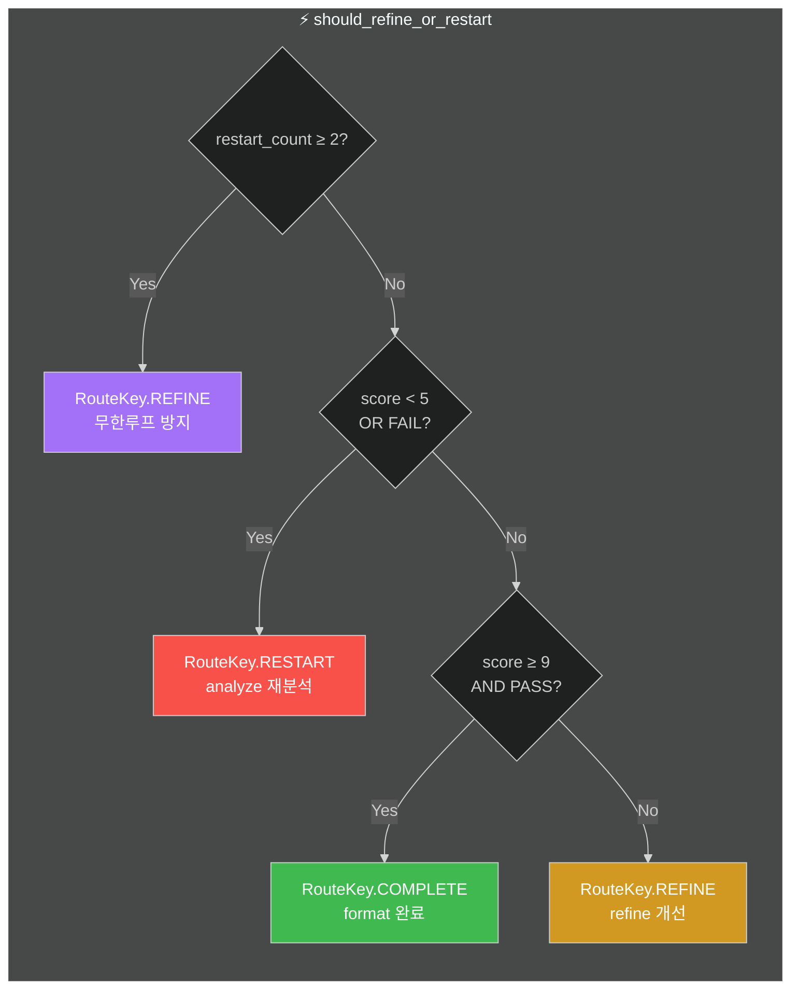
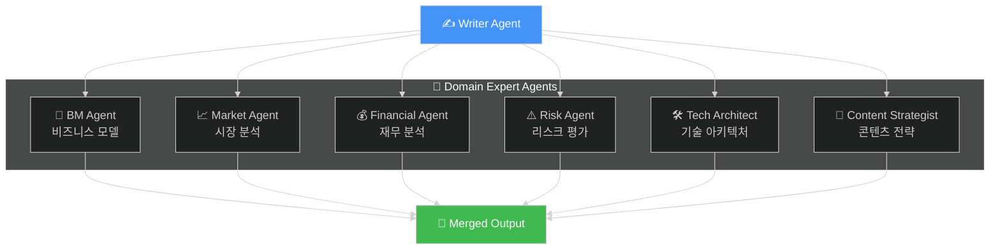

# 🧠 PlanCraft Multi-Agent Architecture (LangGraph)

> LangGraph StateGraph 기반 Multi-Agent 워크플로우 구성도

---

## 📊 전체 워크플로우

---

## 📦 PlanCraftState 구조

---

## 🔀 Routing Decision Table

---

## 🎯 Specialist Agents

---

## 📋 Nodes Summary

| Node | Function | Description | Tags |
|------|----------|-------------|------|
| `retrieve_context` | RAG 검색 | FAISS Vector Store에서 관련 문서 검색 | `rag`, `retrieval` |
| `fetch_web_context` | 웹 검색 | Tavily API로 실시간 웹 정보 수집 | `web`, `search`, `tavily` |
| `run_analyzer_node` | 요구사항 분석 | 사용자 입력 분석, 토픽/목표 추출 | `critical` |
| `option_pause_node` | HITL | 사용자에게 추가 정보 요청 (interrupt) | `hitl` |
| `run_structurer_node` | 구조 설계 | 기획서 목차/섹션 구조 생성 | - |
| `run_writer_node` | 콘텐츠 작성 | 섹션별 상세 내용 작성 | `slow` |
| `run_reviewer_node` | 품질 평가 | PASS/REVISE/FAIL 판정 | `evaluation` |
| `run_refiner_node` | 개선 적용 | 피드백 기반 개선 전략 수립 | - |
| `run_formatter_node` | 최종 포맷팅 | 마크다운 문서 생성 + 출처 추가 | `output`, `final` |

---

## 🔧 Key Technologies

- **LangGraph**: StateGraph 기반 워크플로우 엔진
- **LangChain**: LLM 호출 및 체인 구성
- **FAISS**: 벡터 스토어 (RAG)
- **Tavily**: 실시간 웹 검색 API
- **LangSmith**: 트레이싱 및 모니터링
- **Streamlit**: UI 프레임워크

---

*Generated by PlanCraft Multi-Agent System*
