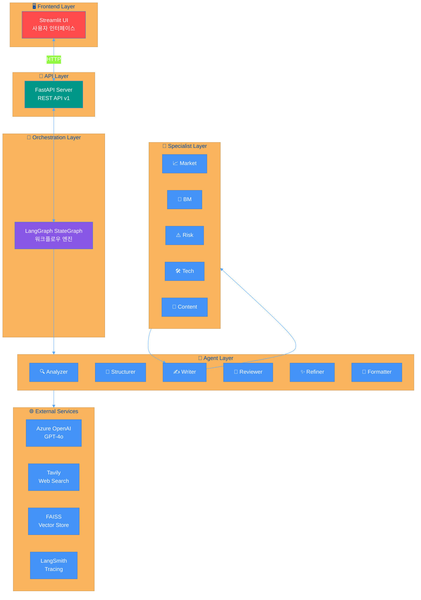
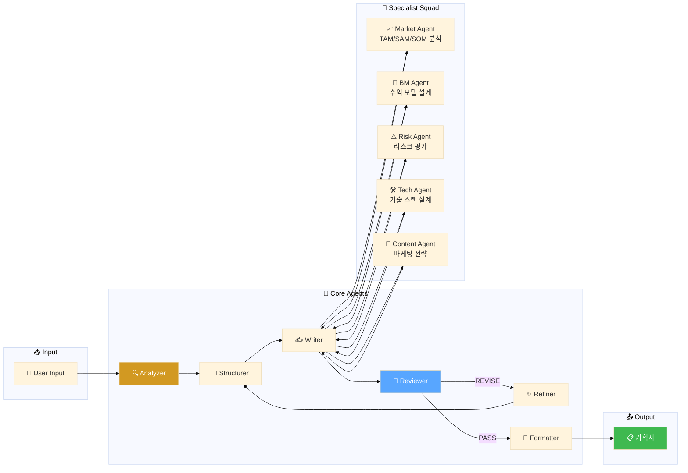
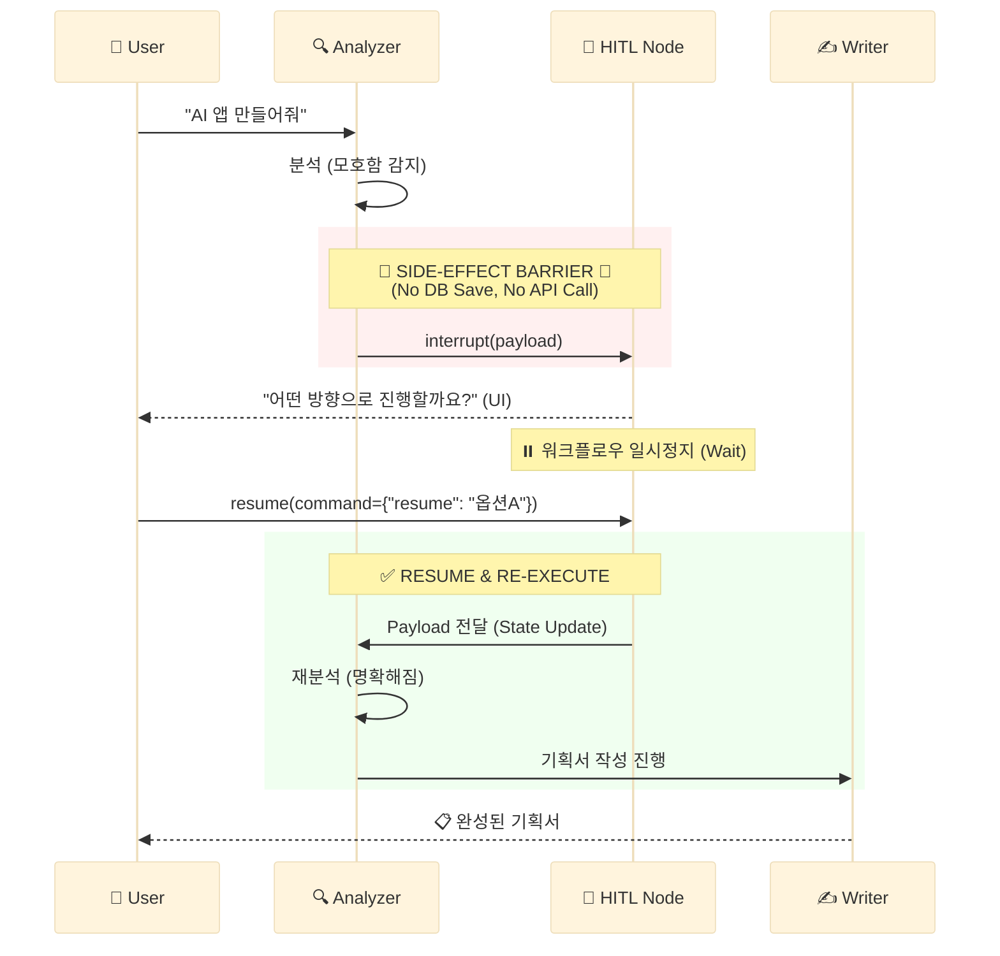
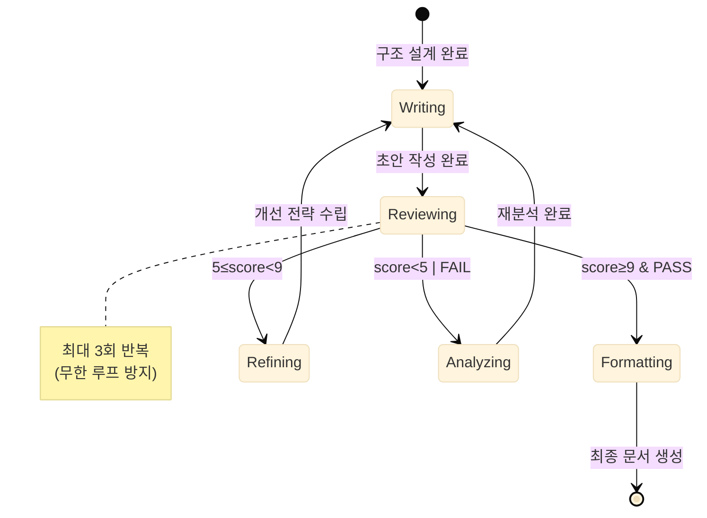
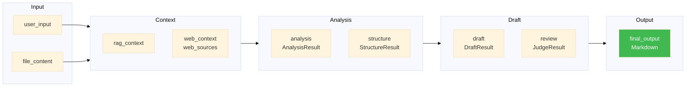
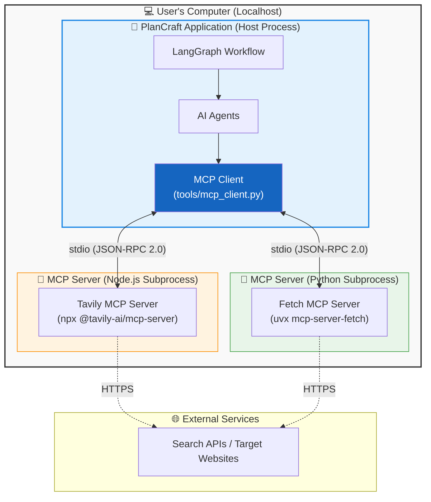
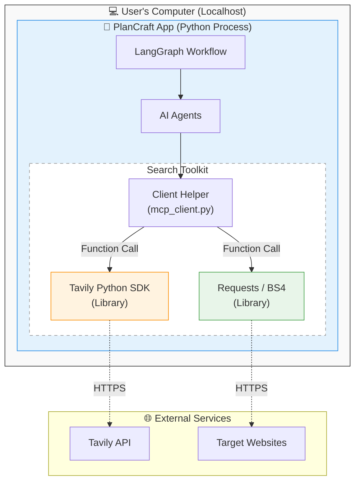

# 🧠 PlanCraft Multi-Agent Architecture

> LangGraph StateGraph 기반 Multi-Agent 워크플로우 구성도

---

## 📊 1. 전체 시스템 아키텍처



---

## 📊 2. 워크플로우 상세 (Workflow Graph)


---

## 📊 3. Agent 협업 구조



---

## 📊 4. Supervisor + Specialist (2-Stage Search)

> **2단계 검색 구조 (Active Search)**:
> 1. Supervisor 단계에서 '넓은 초기 검색' 수행
> 2. Market Agent 내부에서 '정밀 보강 검색(ReAct)' 수행 (최대 2회)

```mermaid
%%{init: {'theme': 'base'}}%%

graph TB
    subgraph STAGE1["Stage 1: Broad Search"]
        SUP[🎖️ Supervisor]
        WEB_CTX[🌐 Initial Web Context<br/>(Executor Result)]
        SUP --> WEB_CTX
    end

    subgraph STAGE2["Stage 2: Active Deep Search"]
        MARKET[📈 Market Agent<br/>(ReAct Agent)]
        
        WEB_CTX --> MARKET
        
        MARKET -->|1. 분석| CHECK{정보 부족?}
        CHECK -->|Yes| SEARCH[🔍 Tavily Active Search]
        SEARCH -->|Result| MARKET
        
        CHECK -->|No / Limit| OUTPUT[📋 Market Analysis<br/>JSON]
        
        style SEARCH fill:#ff9f1c,color:#fff
    end
    
    SUPERVISOR --> MARKET
    
    MARKET -->|Result| MERGE[📦 Result Merger]
    
    style SUP fill:#8957e5,color:#fff
    style MARKET fill:#d29922,color:#fff
```

---

## 📊 5. Human-in-the-Loop (HITL) 상세 흐름

> **Side-Effect Free 원칙**: `interrupt` 이전에 DB 저장을 절대 하지 않음!



---

## 📊 6. 품질 루프 (QA Loop) 상태 전이



---

## 📊 7. PlanCraftState 데이터 흐름



---

## 📊 9. MCP (Model Context Protocol) Architecture

### 9.1 Standard MCP Architecture (Ideal)
> **Client Mode Implementation**:
> Node.js 및 Python 환경이 모두 갖춰진 경우, 표준 자식 프로세스 방식으로 동작합니다.



### 9.2 Fallback Architecture (Actual/Safe Mode)
> **SDK/Library Implementation**:
> `npx` (Node.js)가 없는 환경에서는 자동으로 Fallback 모드로 전환되어, Python 라이브러리를 직접 호출합니다.



---

*Generated by PlanCraft Multi-Agent System*
