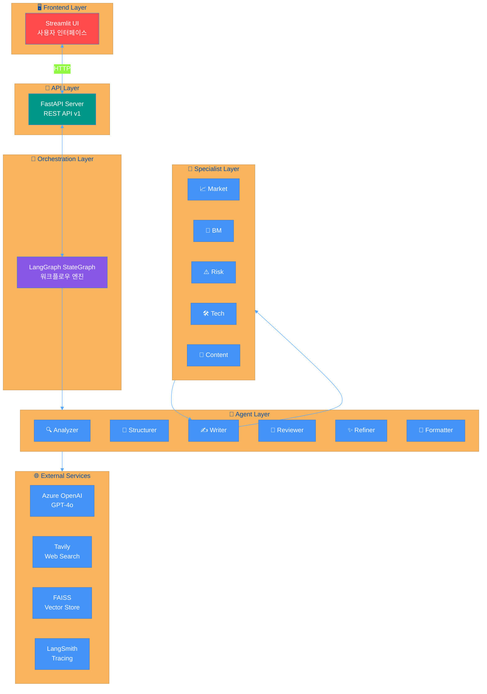
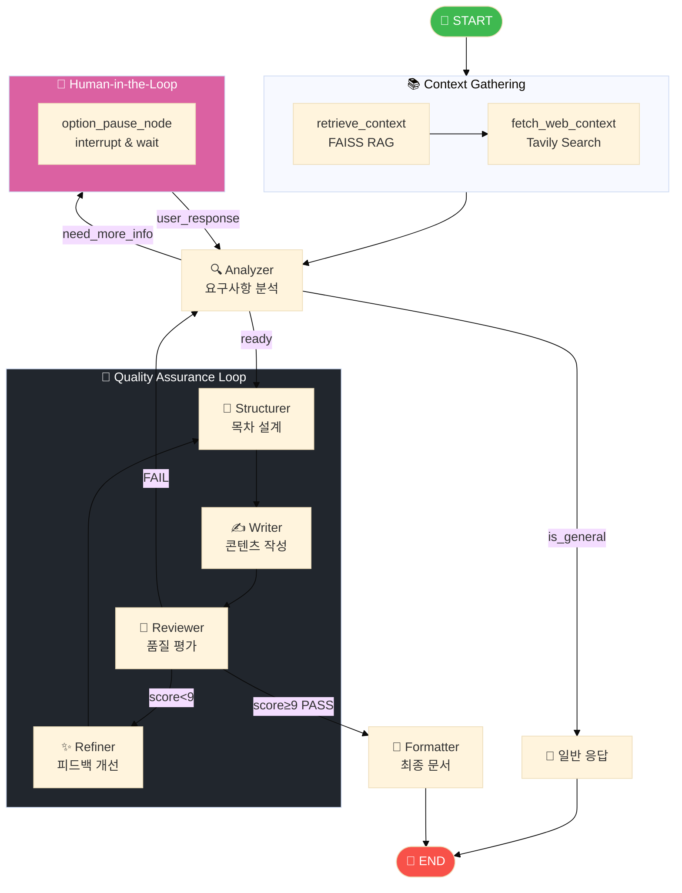
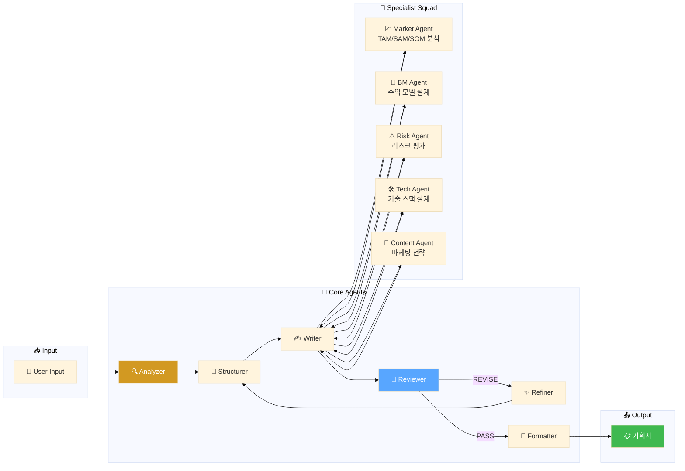
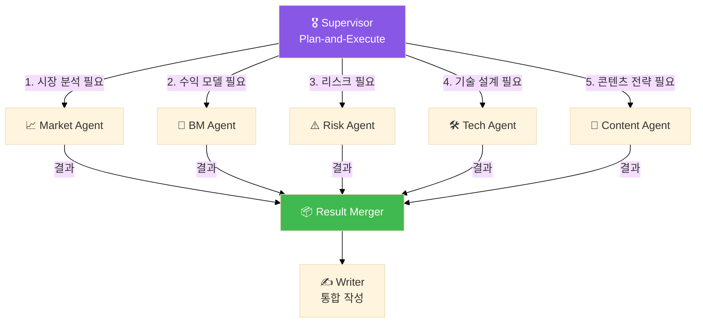
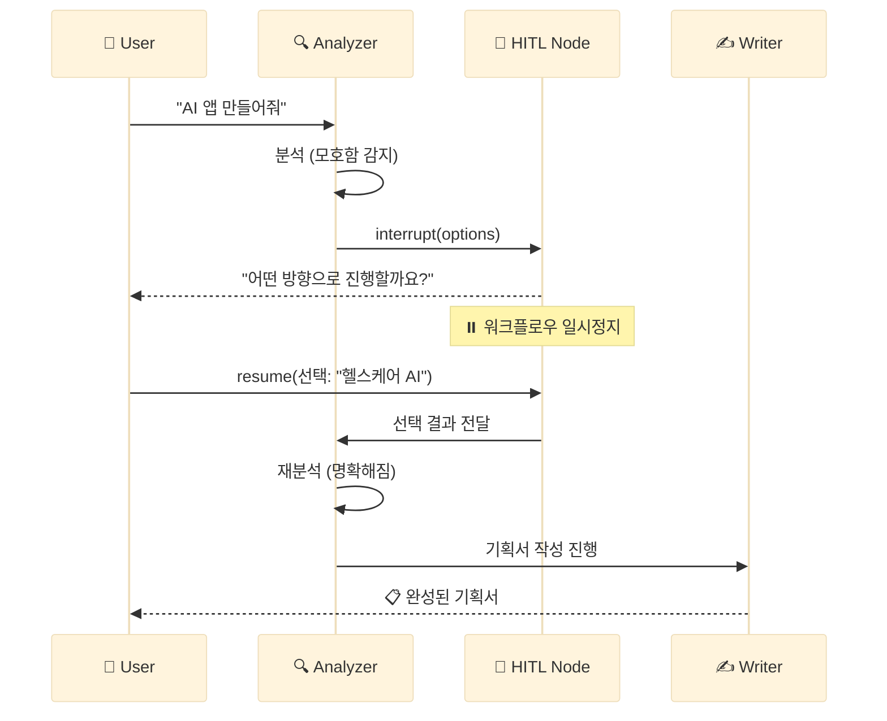
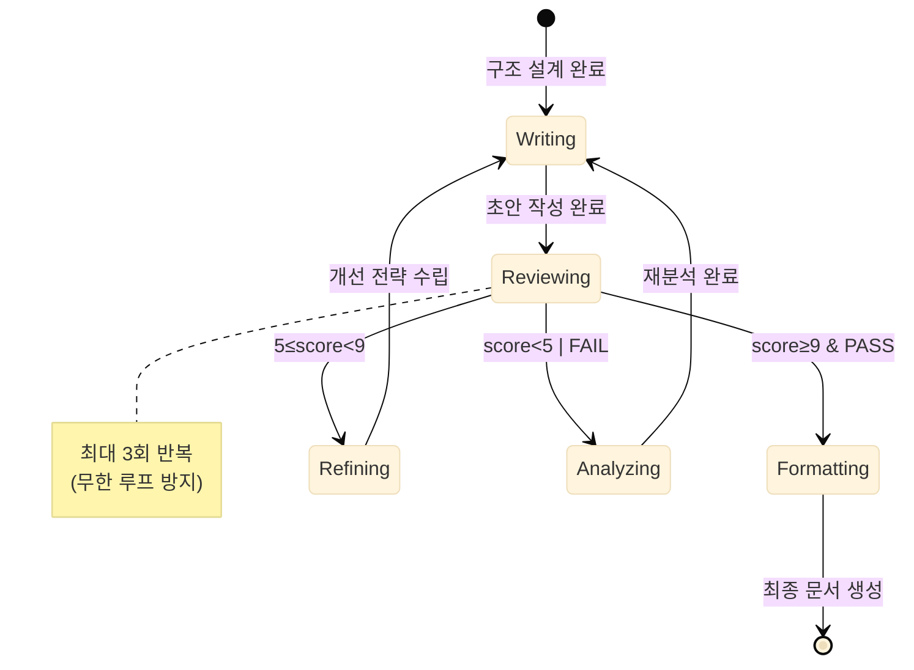
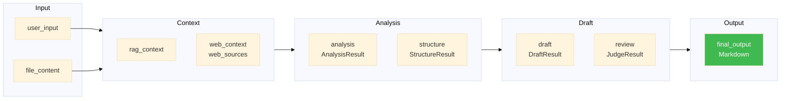
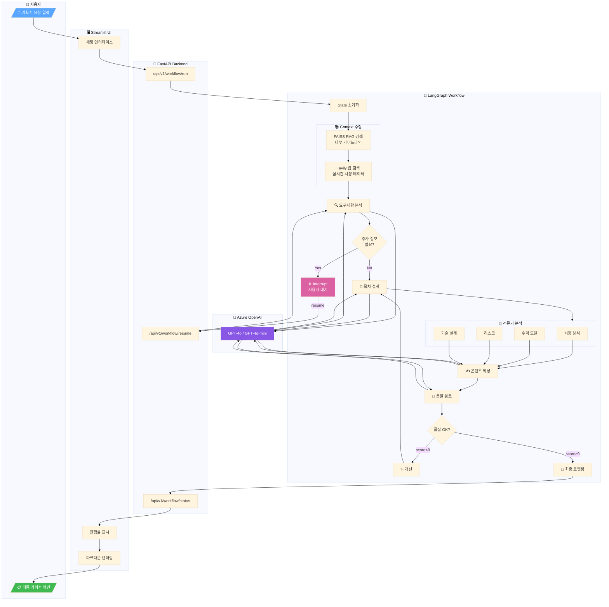
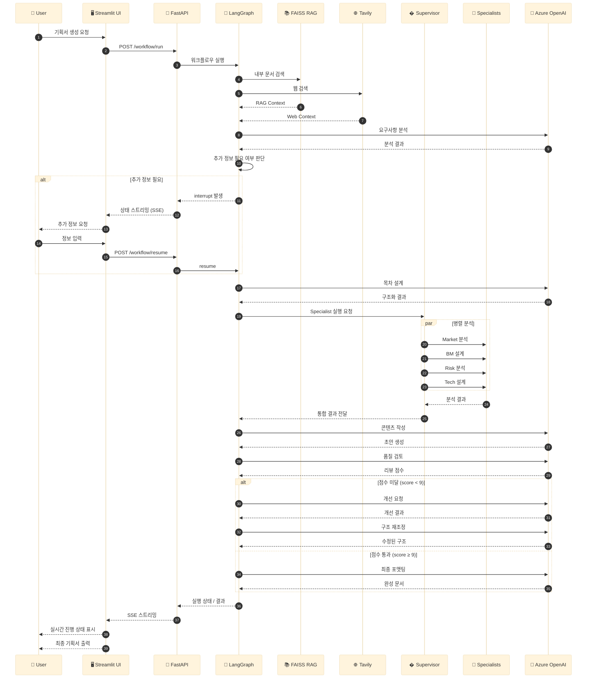

# 🧠 PlanCraft Multi-Agent Architecture

> LangGraph StateGraph 기반 Multi-Agent 워크플로우 구성도

---

## 📊 1. 전체 시스템 아키텍처

---

## 📊 2. 워크플로우 상세 (Workflow Graph)

---

## 📊 3. Agent 협업 구조

---

## 📊 4. Supervisor + Specialist 패턴

---

## 📊 5. Human-in-the-Loop (HITL) 흐름

---

## 📊 6. 품질 루프 (QA Loop) 상태 전이

---

## 📊 7. PlanCraftState 데이터 흐름

---

## � 8. 서비스 플로우 (End-to-End Flow)

### 8.1 전체 요청-응답 흐름 (Flow Chart)

### 8.2 서비스 플로우 시퀀스 (Sequence Diagram)

---

## �📋 Agent 역할 정리

| Agent | 역할 | 입력 | 출력 |
|-------|------|------|------|
| **Analyzer** | 사용자 요구사항 분석 | user_input | AnalysisResult |
| **Structurer** | 기획서 목차 설계 | analysis | StructureResult |
| **Writer** | 섹션별 콘텐츠 작성 | structure + context | DraftResult |
| **Reviewer** | 품질 평가 (PASS/REVISE/FAIL) | draft | JudgeResult |
| **Refiner** | 피드백 기반 개선 | draft + review | Refined Structure |
| **Formatter** | 최종 마크다운 생성 | draft | final_output |

| Specialist | 전문 분야 |
|------------|----------|
| **Market Agent** | 시장 규모 (TAM/SAM/SOM), 경쟁사 분석 |
| **BM Agent** | 수익 모델, 가격 정책, BEP 분석 |
| **Risk Agent** | 법적/기술적/운영 리스크, SWOT |
| **Tech Agent** | 기술 스택, 시스템 아키텍처 |
| **Content Agent** | 마케팅 전략, 브랜딩, User Journey |

---

*Generated by PlanCraft Multi-Agent System*
